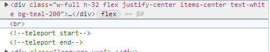
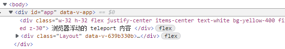

# Teleport to

Teleport 提供了一种干净的方法，允许我们控制在 DOM 中哪个父节点下渲染了 HTML，而不必求助于全局状态或将其拆分为两个组件。

- props
  - to string 指代子组件移动渲染到哪个父组件去 一般会写:body #id选择器字符
  - disabled  bool 是否可以移动


https://v3.cn.vuejs.org/guide/teleport.html#teleport


## 尝试下

<TeleportTo/>

<script setup>
    import TeleportTo from "./components/TeleportTo/index.vue";
</script>


```vue
<template>
    <div class=" w-full h-32  flex justify-center items-center text-white bg-teal-200">
        <p>组件内容</p>
    </div>
    <br/>
    <teleport to="#app">
        <div class="w-32 h-32 text-center text-white  bg-yellow-400 fixed z-30 right-10 top-20">
           <p>浏览器浮动的 teleport 内容</p>
        </div>
    </teleport>
</template>
```

` teleport 内容` 其实已经不在 `组件内容`后边了，为了方便观看，将 `teleport 内容`设置成了浏览器定位，接下来看下 `dom 树结构`



可以看到 `br` 后边没有东西了，去了哪里了呢？



因为我们设置 `to` 为 `#app` 


## 注

teleport 执行的 to 的元素，确保能够在当前组件生成前前能获取到，否则不生效。
