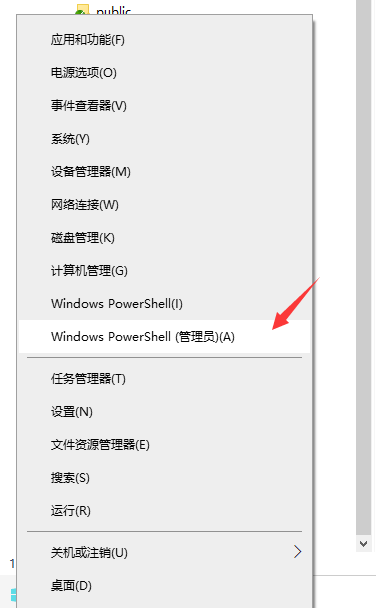

# 002-让你的Windows丝滑的使用Linux


## 第一步 开启WSL

> 假如你已经开启了 `WSL` 可忽略第一步

在`windows`图标右键，选择`Windows Pwershel (管理员(A)`点击打开，如图所示：


然后复制以下字符：
```bash
Enable-WindowsOptionalFeature -Online -FeatureName Microsoft-Windows-Subsystem-Linux
```
在窗口内粘贴，回车执行，后面需要重启电脑，YES即可。

::: warning 谨记
在重启前，要记得收藏当前网页，方便重启后，继续进行第二步。
:::


### 安装包管理器

我们需要安装一个`LxRunOffline`工具，需要借助`choco`工具安装，所以我们先安装`choco`

复制以下字符：
```bash
Set-ExecutionPolicy Bypass -Scope Process -Force; [System.Net.ServicePointManager]::SecurityProtocol = [System.Net.ServicePointManager]::SecurityProtocol -bor 3072; iex ((New-Object System.Net.WebClient).DownloadString('https://chocolatey.org/install.ps1'))
```
回车执行

我们可以在命令行输入 `choco -h` 来检验 `choco` 是否安装成功。假如没有可重新打开命令行窗口重试

还是不行的，可能是因为网络原因 可尝试 `iex (new-object net.webclient).downloadstring('https://get.scoop.sh')`

然后再次使用 `choco -h` 验证

### 安装LxRunOffline

```bash
scoop bucket add extras
scoop install lxrunoffline
```

同样 `lxrunoffline -v` 验证以下


### 下载镜像

**下载地址**
- [Centos镜像-Github地址](https://github.com/CentOS/sig-cloud-instance-images/blob/CentOS-7.8.2003-x86_64/docker/centos-7.8.2003-x86_64-docker.tar.xz)
- 百度网盘 
  - 链接: https://pan.baidu.com/s/167c1u9dSuKQCJ8gV8XMF5w?pwd=ha27 
  - 提取码: `ha27`
- 蓝奏云 
  - 地址：https://wwu.lanzouw.com/iJoyC01sqs1a

::: warning 注意
因为蓝奏云不支持xz类型 所以改为`zip 类型` 后面使用时记得注意这一点 修改`xz`为`zip `
:::


### 安装镜像


```bash
# 命令格式:
LxRunOffline install -n [自定义名称,例如:centos] -d [安装位置] -f [刚才下载镜像文件的位置] -s
```

我文件下载到了 `D盘` 的 `WSL` 文件夹下了

```bash
# 实战:
LxRunOffline install -n Centos -d D:\WSL\Centos -f D:\WSL\centos-7.8.2003-x86_64-docker.tar.xz -s

# 蓝奏云
LxRunOffline install -n Centos -d D:\WSL\Centos -f D:\WSL\centos-7.8.2003-x86_64-docker.tar.zip -s

```

根据自身情况 修改对应的参数