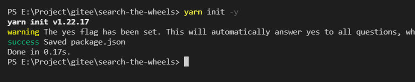
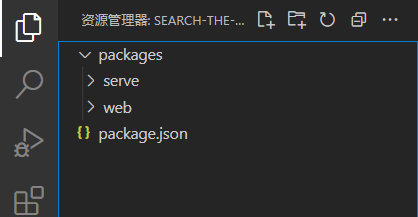

# 004-学习使用 monorepo 

## monorepo 是做什么的?

`monorepo`可以让我们在依赖上，关联上有着更大的便利。


举个例子：
- 我有一个博客系统，一个前台仓库，一个后台仓库，都是前端项目。
- 但是两个项目是分开的，
- 但是有很多公共的东西，像组件、数据结构说明、组件库、工具类库。
- 有时会出现复制一个仓库的代码给另一个仓库使用 非常low
- 那有没有办法 可以做到像类库一样引入使用

## 使用操作

那接下来,说说 `monorepo` 看看如何使用 

从一个仓库创建开始：

### 初始化项目

新建文件夹 `search-the-wheels` 作为我们新的项目，然后`yarn init -y` 或 `npm init -y`




`package.json`文件添加如下内容：

### 配置 `workspaces`

```json
{
    "name": "search-the-wheels",
    "version": "1.0.0",
    "main": "index.js",
    "author": "chunshan <1484082125@qq.com>",
    "license": "MIT",
    "workspaces": [
        "packages/*"
    ]
}
```


> 注：`packages` 这个只是文件夹的名字，并不是唯一固定的，`workspaces` 也可以添加更多其他的文件夹

### 创建子项目

然后我们在根目录新建文件夹 `packages`,并在该文件夹下创建子项目文件夹



### 配置子项目

我们在子项目文件夹下，再次初始化项目。`yarn init -y`


