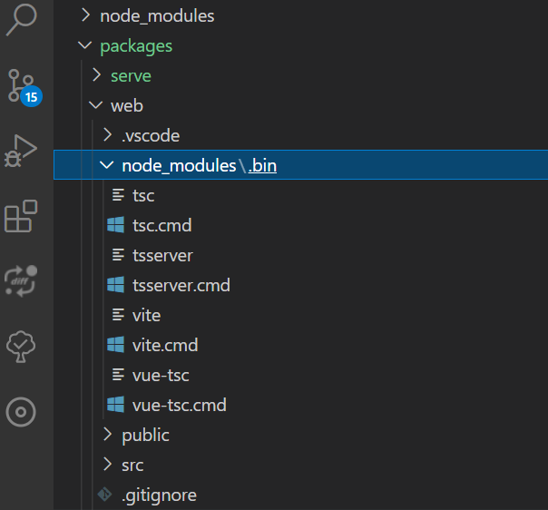
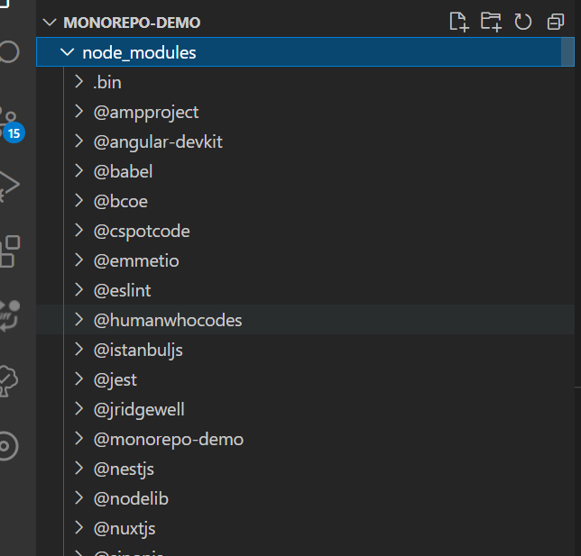
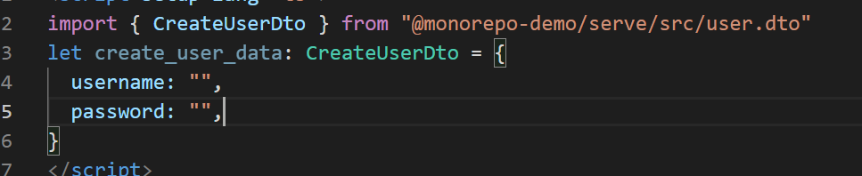

# 004-学习使用 monorepo 

> 实践出真知，我们先创建一个新项目，来了解 `monorepo` 的作用。最后有`monorepo-demo`的 github链接

## 开始

### 初始化项目

- 创建文件夹 `monorepo-demo` 文件夹，进入新建项目文件地址
- 执行 `yarn init -y`
- 打开 `package.json` ，增加 `workspaces` 字段
- 子项目我想放在 `monorepo-demo/packages/` 下，所以我的配置如下：

```json
{
  "name": "monorepo-demo",
  "version": "1.0.0",
  "main": "index.js",
  "license": "MIT",
  "private": true,
  "workspaces": [
    "packages/*"
  ]
}
// Workspaces can only be enabled in private projects.
// workspaces 只能放在私有项目工作区内
```
### 创建子项目

- 制作一个网站，前端(web)使用 `vite` ,后端(serve)使用 `nest.js`。
- `packages`下，创建`vite项目web`，创建`nest.js项目serve`
- `web` 下的 `package.json` 的 `name` 改成了 `@monorepo-demo/web`
- `serve` 下的 `package.json` 的 `name` 改成了 `@monorepo-demo/serve`


### 安装依赖

我们回到项目根目录，执行`yarn`




::: tip
是不是发现子项目的依赖，几乎没有了，现在都在根目录的`node_modules`下了。
:::


### 引用便捷 nice
> 这个是最舒服的，我在`serve`定义了请求的结构，我的`web`引用直接使用，接下来开始：
```ts
// packages\serve\src\user.dto.ts
export class CreateUserDto {
    username: string;
    password: string;
}
```
然后回到，`web/src/App.vue`



我们通过`@monorepo-demo/serve`可直接找到`serve`项目，然后引用项目下的子内容

这样就通了，在开发时，这种情况，只在一个位置写结构，多个位置都可以引用，非常方便。

::: warning
当然，不完全建议这样，我们可以在创建一个子项目，比如:`packages/types`，主要放置各种公用部分代码
:::

### 最后

- [monorepo-demo 源码](https://github.com/chunshand/monorepo-demo)