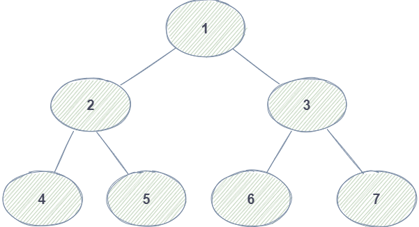
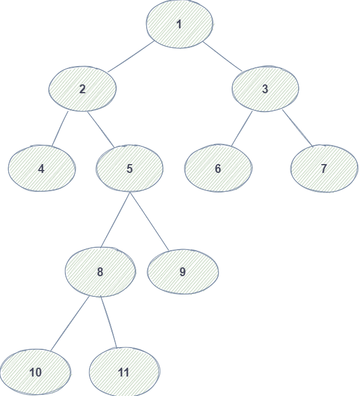

# 二叉树


## 什么是二叉树


- 对于树一般都熟悉，前端最常见的dom树
- 所谓二叉树，就是除了根节点，子节点都是两个

如图所示：



用代码描述下二叉树
```js
// left right 不存在子节点则为null
const tree = {
    val: 1,
    left: {
        val: 2,
        left: {
            val: 4,
            left: null,
            right: null
        },
        right: {
            val: 5,
            left: null,
            right: null
        }
    },
    right: {
        val: 3,
        left: {
            val: 6,
            left: null,
            right: null
        },
        right: {
            val: 7,
            left: null,
            right: null
        }
    }
}

```

## 深度优先遍历

---

- 如图，深度优先遍历，看名字就知道先要到深处去
- 我们看到每个节点都有着数字标识。接下来用**数字标识**来表示遍历的走向


### 前序遍历(先序遍历)

顺序是：`1`、`2`、`4`、`5`、`3`、`6`、`7`

```js
function midOrder(root) {
    if (root) {
        console.log(root.val);
        if (root.left) {
            midOrder(root.left);
        }
        if (root.right) {
            midOrder(root.right);
        }
    }

}
midOrder(tree)

```

### 中序遍历

顺序是：`4`、`2`、`5`、`1`、`6`、`3`、`7`

```js
function centerOrder(root) {
    if (root) {
        if (root.left) {
            centerOrder(root.left);
        }
        console.log(root.val);
        if (root.right) {
            centerOrder(root.right);
        }
    }

}
centerOrder(tree)
```

### 后序遍历

顺序是：`4`、`5`、`2`、`6`、`7`、`3`、`1`

```js
function postOrder(root) {
    if (root) {
        if (root.left) {
            postOrder(root.left);
        }
        if (root.right) {
            postOrder(root.right);
        }
        console.log(root.val);
    }

}
postOrder(tree)

```
## 广度优先遍历

---

顺序是：`1`、`2`、`3`、`4`、`5`、`6`、`7`


```js
// 需要用数组 来模拟任务队列
let arr = []
function breadthOrder(root) {
    if (root) {
        arr.push(root);
        console.log(root.val);
    };
    while (arr.length > 0) {
        // 删除数组的第一个并取出
        let head = arr.shift();
        if (head.left) {
            arr.push(head.left)
            console.log(head.left.val);
        }
        if (head.right) {
            arr.push(head.right)
            console.log(head.right.val);
        }
    }
}
breadthOrder(tree)

```


## 获取二叉树的最大深度和最小深度

上图：



看图所示，

- 1 是第一层 
- 2、3 是第二层 
- 4、5、6、7 是第三层 
- 8、9 是第四层 
- 10、11 是第五层 


现在我们把图，换成代码表示。
```js
const tree = {
    val: 1,
    left: {
        val: 2,
        left: {
            val: 4,
            left: null,
            right: null
        },
        right: {
            val: 5,
            left: {
                val: 8,
                left: {
                    val: 10,
                    left: null,
                    right: null
                },
                right: {
                    val: 11,
                    left: null,
                    right: null
                }
            },
            right: {
                val: 9,
                left: null,
                right: null
            }
        }
    },
    right: {
        val: 3,
        left: {
            val: 6,
            left: null,
            right: null
        },
        right: {
            val: 7,
            left: null,
            right: null
        }
    }
}

```
**获取最大深度**

```js

let arr = []
function handleGetMaxDepth(root) {
    let maxDepth = 0;
    if (!root) {
        return maxDepth;
    };
    arr.push(root)
    while (arr.length > 0) {
        let len = arr.length
        maxDepth++;
        // 相同一层的处理完后 在进行下一次的while
        for (let i = 0; i < len; i++) {
            let node = arr.shift();
            node.left && arr.push(node.left);
            node.right && arr.push(node.right);
        }
    }
    return maxDepth;
}
console.log(handleGetMaxDepth(tree));

```
> N叉树获取最大深度也是同样的原理，举一反三

**获取最小深度**

通过最大深度算法，稍微一改变 就可以

```js

let arr = []
function handleGetMinDepth(root) {
    let maxDepth = 0;
    if (!root) {
        return maxDepth;
    };
    arr.push(root)
    while (arr.length > 0) {
        let len = arr.length
        maxDepth++;
        // 相同一层的处理完后 在进行下一次的while
        for (let i = 0; i < len; i++) {
            let node = arr.shift();
            // 假如左子树 和 右子树 都不存在 则是最小深度
            if (!node.left && !node.right) {
                return maxDepth;
            }
            node.left && arr.push(node.left);
            node.right && arr.push(node.right);
        }
    }
    return maxDepth;
}
console.log(handleGetMinDepth(tree));

```