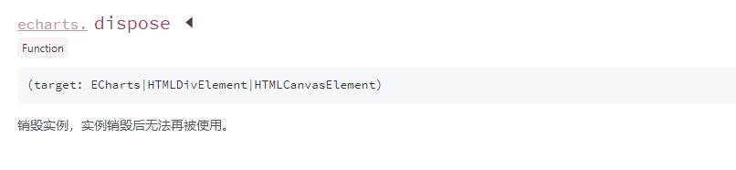

# 浏览器回退，echarts数据正常，但是视图未更新

## 代码

```js

const handleUpdateEcharts = (arr)=>{
    let option: echarts.ECBasicOption = myChart.getOption();
    option.series[0].data = arr;
    myChart.setOption(option);
}

onMounted(()=>{
    let myChart: echarts.EChartsType
    let dom: HTMLElement = document.getElementById('echarts_dom') as HTMLElement;
    myChart = echarts.init(dom)
})


```

`myChart.setOption` 并没有更新试图，但是再次打印 `myChart.getOption()` 数据确实更新上去了


## 后来

```js

const handleUpdateEcharts = (arr)=>{
    let option: echarts.ECBasicOption = myChart.getOption();
    option.series[0].data = arr;
    myChart.setOption(option);
}

onMounted(()=>{
    let myChart: echarts.EChartsType
    let dom: HTMLElement = document.getElementById('echarts_dom') as HTMLElement;
    echarts.dispose(dom);// 不同 ####
    myChart = echarts.init(dom)
})


```

在 `init` 前需要 `dispose`下然后再 `init` ,这样就正常了




附：

- [dispose api](https://echarts.apache.org/zh/api.html#echarts.dispose)
- [容器节点被销毁以及被重建时](https://echarts.apache.org/handbook/zh/concepts/chart-size/#%E5%AE%B9%E5%99%A8%E8%8A%82%E7%82%B9%E8%A2%AB%E9%94%80%E6%AF%81%E4%BB%A5%E5%8F%8A%E8%A2%AB%E9%87%8D%E5%BB%BA%E6%97%B6)