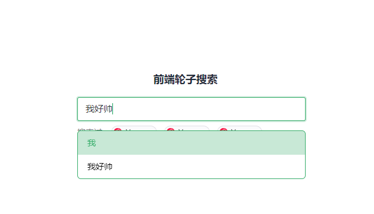
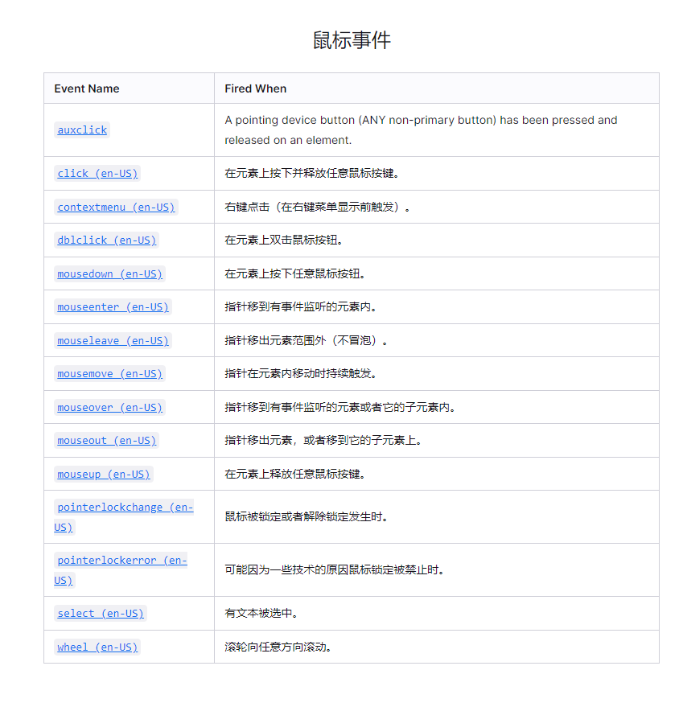
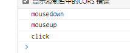
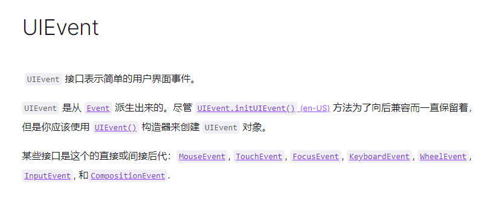
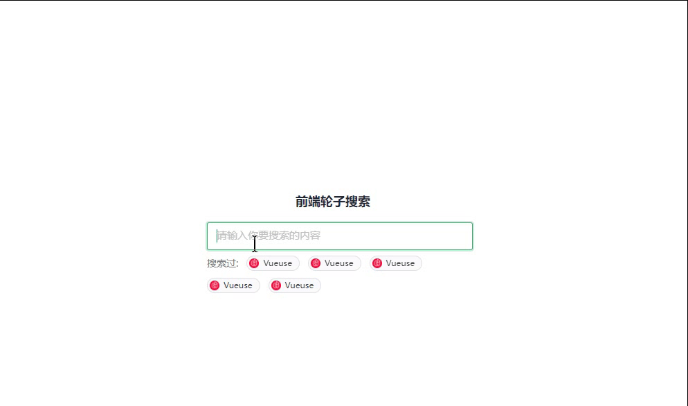

# 输入框失去焦点，点击事件失效了

## 寻找原因

> 我们知道，输入框失去焦点在无自定义操作下会触发`blur`事件,但是这个时候的点击事件并不能监听到



图1

点击选项，根本就帅不起来了，开始寻找问题




这是MDN上的鼠标事件的截图，可以看出对于点击事件，相关的就只有`mousedown` `click` `mouseup`

我在没有输入框的业务场景下，对一个普通页面元素上监听 `mousedown` `click` `mouseup` 事件，进行测试:



由此可以看出：`click` 在  `mousedown`  `mouseup` 后执行

然后我在前面图1的选项元素上监听 `mousedown` `click` `mouseup` 事件，输入框监听`blur`事件

执行后，顺序是:`mousedown  blur`,因而 `blur` 是 `mousedown` 后触发的

<!-- 事件的冒泡 和 捕获  -->

- `mousedown`属于`MouseEvent` 
- `blur` 属于`FocusEvent`



而两者属于都是`UiEvent`

`blur`事件，阻止了后面`mouseup``click`的执行。

## 解决方法

**解决方法1：**

`mousedown` 阻止默认行为

```js
e.preventDefault();
```
`click` 是在鼠标按下 放开后的执行，业务逻辑上,在手动执行 输入框的`blur`


**解决方法2(推荐 代码改的少)：**

`mousedown` 替代 `click` 执行业务方法逻辑

## 最后



附录：

- https://developer.mozilla.org/zh-CN/docs/Web/API/Element/mousedown_event
- https://developer.mozilla.org/zh-CN/docs/Web/API/MouseEvent
- https://developer.mozilla.org/zh-CN/docs/Learn/JavaScript/Building_blocks/Events
- https://developer.mozilla.org/zh-CN/docs/Web/API/Event/preventDefault